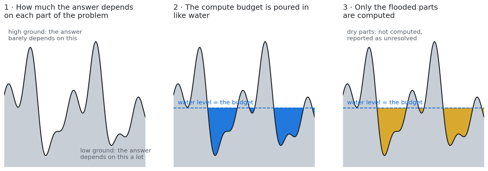
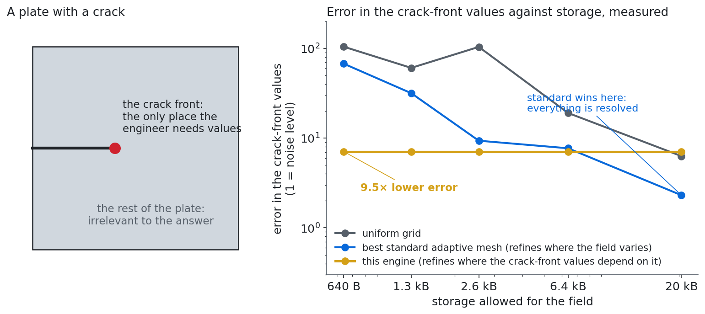
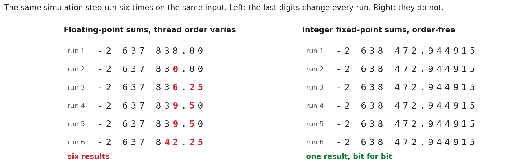
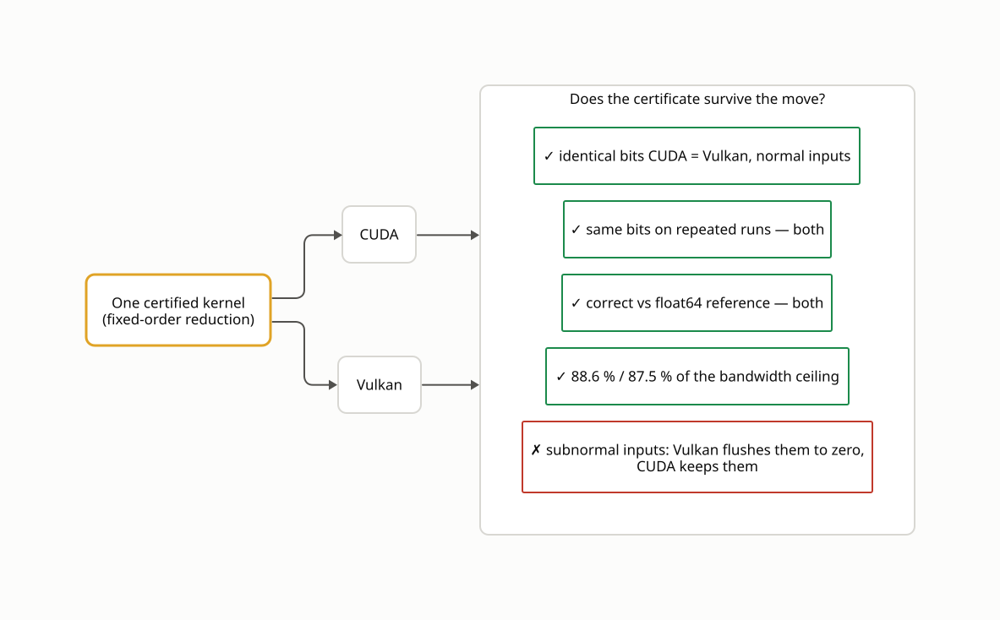
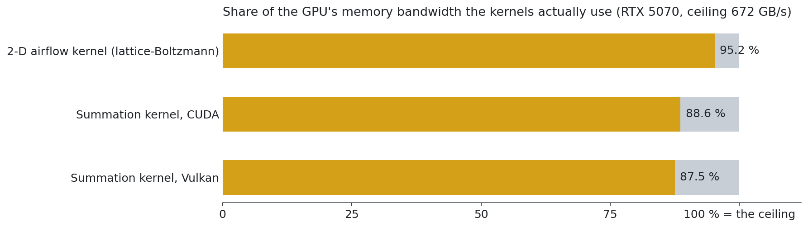

<picture>
  <source media="(prefers-color-scheme: dark)" srcset="docs/brand/banner-dark.png">
  
</picture>

<picture>
  <source media="(prefers-color-scheme: dark)" srcset="docs/fig7/hero-vortex2-dark.png">
  
</picture>

*Air flowing past a cylinder, computed on one GPU with this engine's fluid kernel. Vorticity is shown: red turns one way, blue the other. Reynolds number 256; the vortices are shed at a Strouhal number of 0.210, matching the reference value 0.20–0.21. 614 000 cells, 60 000 time steps, 3.2 seconds.*

> Part of 3FOLD · results are nodes in the [Decorrelation Graph Engine](https://github.com/OWNER/3fold-graph-engine)

---

## What it is

Kernel Engine does two things for the platform's simulation code. It decides where in a problem to spend precision and resolution, based on what the engineer actually wants to know. And it makes GPU kernels written by a language model usable: it runs each kernel in several settings and keeps only settings that give the same answer as a reference, the same bits every time, and run faster.

---

## How it decides where to spend compute

<picture>
  <source media="(prefers-color-scheme: dark)" srcset="docs/fig7/waterfilling9-dark.png">
  
</picture>

Every simulation spends effort unevenly: a few parts of the problem decide the answer, most barely move it. The engine measures which parts matter for the answer the engineer asked for, then fills them first, like water poured into a landscape. Parts the water never reaches are not computed and are reported as unresolved rather than guessed.

<picture>
  <source media="(prefers-color-scheme: dark)" srcset="docs/fig7/crack12-dark.png">
  
</picture>

*Measured on a plate with a crack, where the engineer only needs the stress along the crack front. A standard adaptive mesh refines wherever the field varies most, which is not the same thing. This engine computes, for every location in the plate, how much the crack-front values change when that location changes, and gives resolution only where that number is large. At 640 bytes of storage the crack-front values came out with 9.5× smaller error than the best standard adaptive mesh; at 1.3 kB, 4.5×. The engine's line is flat because it stops at 326 bytes: everything above the noise level is already stored, so more storage buys nothing. Above about 6 kB the standard mesh wins, because by then it resolves everything anyway.*

The same rule is used in other places: to decide how many bits each weight of a language model gets (below), which parts of a stored field may be discarded, and where a mesh should refine. The mesh module is imported by 19 other tools on the platform.

---

## How a kernel is verified before it runs

Kernel Engine writes the GPU code behind simulations like the one above, and lets a kernel run only after it has proved it is correct, repeatable and fast.

**Before anything is written**, the engine reads four numbers off the task itself: the fewest bytes that must move, which sets the speed ceiling; whether the inputs determine the outputs at all; how much run-to-run variation the answer can tolerate; and how often threads will write to the same place. The kernel's settings follow from those four and one hardware number. On the public KernelBench set, the first two numbers alone settle 89 of 100 kernels; 11 could not be parsed by the tool.

**Then the kernel is tested.** A generated kernel goes through three verification steps: it must give the same answer as a slow reference program, the same bits every time it runs, and run faster than what it replaces.

**Why "the same bits every time" matters.** A GPU adds thousands of numbers in parallel, and the order of addition changes the last digits. A simulation whose result drifts from run to run cannot be used to sign off a design. In the platform's contact engine, the same scene run twice gave contact positions 0.32 mm apart for exactly this reason. The fix, adding in a fixed order with integer accumulation, was measured to cost a quarter of the kernel's speed and to remove the drift entirely.

<picture>
  <source media="(prefers-color-scheme: dark)" srcset="docs/fig7/sixruns12-dark.png">
  
</picture>

*One reduction over 2.1 million voxels, run in six separate processes on the same input. Left: floating-point sums, six different answers. Right: integer fixed-point sums, one answer, bit for bit.*

<picture>
  <source media="(prefers-color-scheme: dark)" srcset="docs/fig6/vulkan-dark.svg">
  
</picture>

The same verified kernel was moved from CUDA to Vulkan on the same GPU and tested again: three repeated runs for identical bits, correctness against a 64-bit reference, a bit-for-bit comparison between the two APIs over four input sizes and four input patterns, and the bandwidth fraction. It kept its verification on all counts but one: numbers smaller than about 10⁻³⁸ are rounded to zero by the Vulkan driver, not by CUDA. That difference was found by the verification, which is what it is for.

---

## Performance against the hardware ceiling

<picture>
  <source media="(prefers-color-scheme: dark)" srcset="docs/fig7/roofline9-dark.png">
  
</picture>

A kernel cannot move data faster than the memory system allows; these run at 88–95 % of that limit. "Best in class" is defined this way throughout, achieved bandwidth over the physical ceiling, because it can be measured and cannot be gamed. The 2-D airflow kernel reaches 95 %; the summation kernel used in the Vulkan test reaches 89 % on CUDA and 88 % on Vulkan.

**The solvers the kernels serve.** A lattice-Boltzmann fluid family, one thread per voxel, local collision and nearest-neighbour streaming, no sequential solver and no atomics: the canonical D2Q5 and D2Q9 primitives have 12 importers; the fused 2D kernel runs at 95.2 % of the memory-bandwidth roofline, 7 445 million lattice updates per second, Poiseuille error 0.018 %; an fp16 storage variant was measured and gave no gain. Alongside: a compressible Euler solver with an HLLC flux, two differentiable wave solvers (a Yee FDTD with 6 importers, and an acoustic/electromagnetic time-stepping solver), and immersed-boundary sphere drag whose 1.79× excess over Stokes decomposes into three separable effects.

---

## A digital twin of the GPU

To separate a kernel's number from the machine it ran on, the engine keeps a twin of the GPU as a deterministic base plus a stochastic residual, the same form as its physics twins. The base is geometry: memory sectors per request, occupancy, bank conflicts, computed exactly; the residual is measured. The lab GPU's sheet: 48 SMs, 48 MiB L2, 672 GB/s theoretical, a measured bandwidth identity of 632 GB/s, an L1 knee between 64 and 128 KiB, a latency ladder from 22.6 to 340 ns. Under co-tenancy a victim kernel's slowdown is linear in its own host-sync density, about 2.2 ms per sync, which is the driver's time-slice quantum. GPU hardware fair-shares resources, while the task optimum is water-filling; the gap is movable per resource type, stream priority recovers 0.90 of it for SM scheduling at no cost. Telemetry without custom drivers tops out near 10 Hz for power via NVML; kernel timing comes from CUPTI.

---

## Minimal language models as instruments

The platform trains small language models it can fully instrument, reading their internal signals directly, and uses them to test the engine's allocation rules on a model instead of a simulation. Three results.

**Precision on the weights.** The same water-filling rule decides how many bits each weight gets. At a matched bit budget it beat uniform precision by 14 percentage points at 3 bits on a small dense model, and by 40 to 58 points at 1 to 2 bits on a sparse, heavily over-parameterised one, over 10 paired seeds. Shuffling the same bits to random weights was worse than uniform, so the placement is what wins.

**Routing between experts.** A router that sends each input to the expert whose answer is best determined, measured from the model's own signal-to-noise, beat a learned gate of the same or larger size on held-out error in 8 of 8 seeds, by 15 to 19 %.

**Tokens sized by information.** A tokenizer that closes a token when the accumulated surprise reaches a fixed number of bits, so every token carries about the same information. Models trained on it reach a given quality in 0.4 to 0.6 of the steps, but byte-level models win at convergence, so it is a throughput gain, not a quality gain. Combined with the precision rule: 4.0× more content per second at 0.56× the memory.

One more result, on where not to skip work: the cheap signals a model exposes for skipping computation point the wrong way exactly at the tokens where the deep layers change the answer, so a naive early exit cuts compute precisely where it is needed.

---

## What is standard here, and what is not

**Standard.** Allocating a budget by water-filling on a sensitivity spectrum is rate-distortion theory. Enumerating kernel variants and benchmarking them is what ATLAS, Kernel Tuner and Triton's autotuner do. Kernels written by language models are the subject of KernelBench and related work.

**Not standard.** Reading the requirements off the task before any code exists, and letting them settle most kernels. Allocating resolution by what the engineer asked for rather than by where the field varies. Treating the three tests as a gate with planted bugs, so a kernel a language model wrote can be used without reading it. Carrying the same verification from CUDA to Vulkan and letting it find the difference.

---

<b>Numbers</b> (fine print)

| Measured | Value |
| --- | --- |
| Cylinder wake, 960 × 640 cells, 60 000 steps, Re 256 | Strouhal 0.210 (probe 3 D downstream, FFT); 11 420 MLUPS on RTX 5070, working set resident in the 48 MiB L2 |
| Duct-bend airflow, 300 k cells, 4 000 steps | ~1 s on RTX 5070 |
| Lattice-Boltzmann D2Q9 fused kernel | 95.2 % of roofline, 7 445 MLUPS, Poiseuille error 0.018 % |
| Matrix-vector variant | 1.334×, identical bits |
| 2D closing, GPU vs CPU library, 1 243 × 1 201 raster | 104.75× / 137×, identical pixels, wired in behind a flag |
| Planted race and off-by-one | both caught |
| KernelBench level 1 | 89 of 100 kernels settled by the first two requirements (52 compute-bound, 37 memory-bound, 0 abstain; 11 not parsed) |
| Six-process float32 spread / int64 | 4.6 × 10⁻⁶ relative / identical |
| int64 fixed-point reduction time | 0.74× |
| CUDA → Vulkan port | roofline 0.886 / 0.875; subnormals flushed on Vulkan |
| Crack plate at 640 B / 1 280 B / 20 kB | 9.5× / 4.5× / loses |
| Topology optimisation, measured load case | −50 % mass, compliance ×1.335 |
| GPU sheet, co-tenancy law | 632 / 672 GB/s; 22.6 → 340 ns; ≈ 2.2 ms per sync |
| Water-filling on weights, matched bit budget | +14.4 pp at 3 bits (dense, 682 params); +40–58 pp at 1–2 bits (sparse, 1.13 M params); 10 paired seeds |
| Identifiability router vs learned gate | 8 of 8 seeds, −15 to −19 % held-out error |
| Information-sized tokenizer (crossing law) | 0.38–0.58× steps to shared quality; byte-level +0.30–0.60 at convergence; poxel ⊗ quant 4.03× content/s at 0.56× VRAM |
| Quantization floor | c·ε·σ_max, c ≈ 0.23; fp8 and above free; per-tensor fp4 saturates |
| LLM early-exit signals anti-align with compute need | GPT-2, Qwen; 8 prompts |

